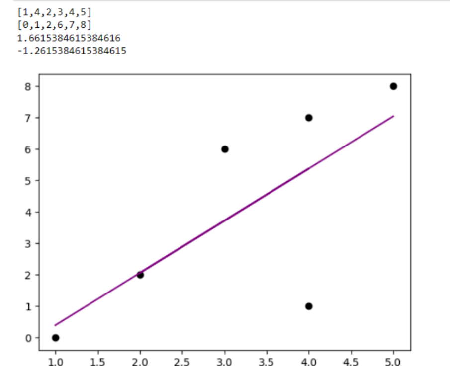

# Implementation of Univariate Linear Regression
## AIM:
To implement univariate Linear Regression to fit a straight line using least squares.

## Equipments Required:
1. Hardware – PCs
2. Anaconda – Python 3.7 Installation / Jupyter notebook

## Algorithm
1. Get the independent variable X and dependent variable Y.
2. Calculate the mean of the X -values and the mean of the Y -values.
3. Find the slope m of the line of best fit using the formula. 

4. Compute the y -intercept of the line by using the formula:

5. Use the slope m and the y -intercept to form the equation of the line.
6. Obtain the straight line equation Y=mX+b and plot the scatterplot.

## Program:
```
/*
Program to implement univariate Linear Regression to fit a straight line using least squares.
Developed by: ARAVIND G
RegisterNumber: 212223240011
*/
```
import numpy as np
import matplotlib.pyplot as mpl
x=np.array(eval(input()))
y=np.array(eval(input()))
xmean=np.mean(x)
ymean=np.mean(y)
num=[]
deno=[]
for i in range(len(x)):
xd=x[i]-xmean
yd=y[i]-ymean
a=xd*yd
num.append(a)
b=xd*xd
deno.append(b)
m=sum(num)/sum(deno)
c=ymean-m*xmean
y_predicted=m*x+c
print(m)
print(c)
mpl.scatter(x,y,color='black')
mpl.plot(x,y_predicted,color='purple')
mpl.show()


## Output:




## Result:
Thus the univariate Linear Regression was implemented to fit a straight line using least squares using python programming.
